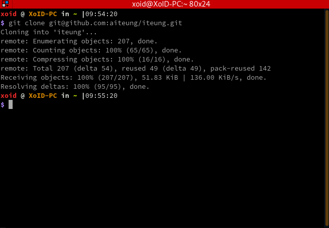
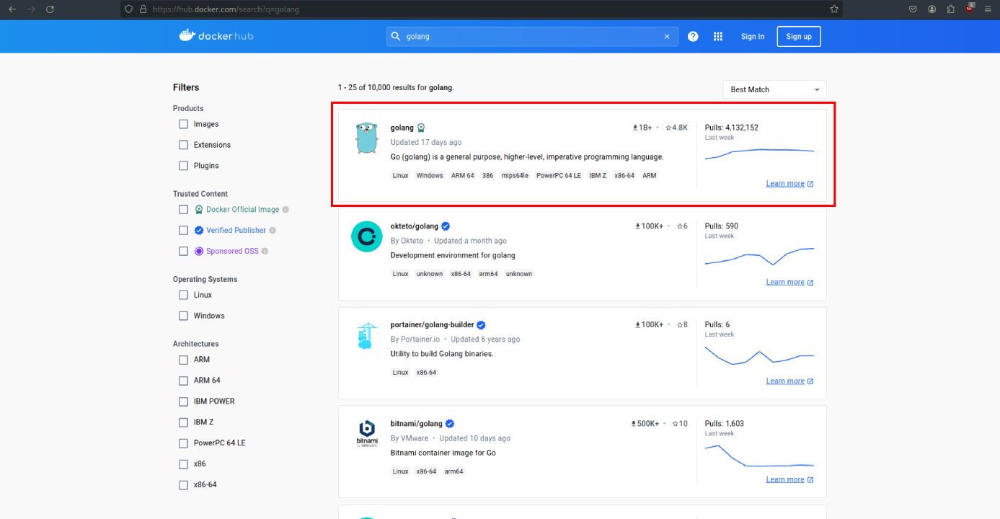
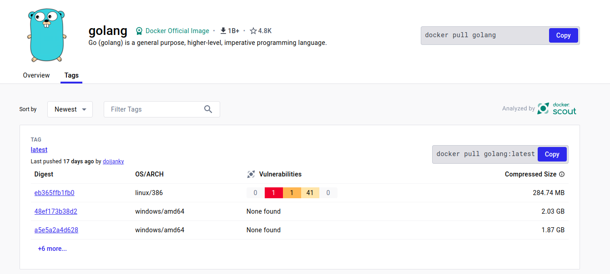
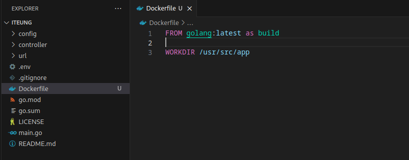
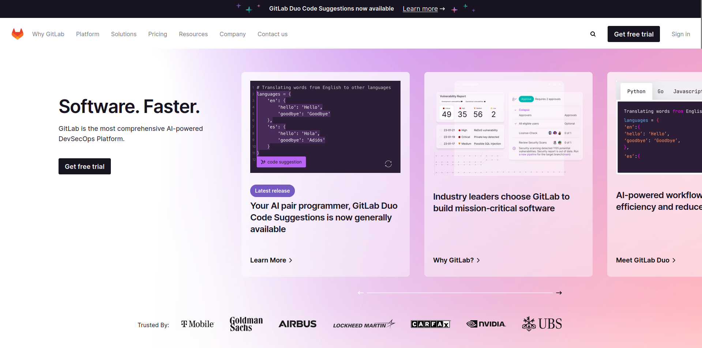
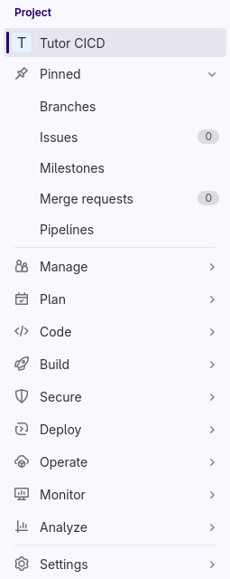
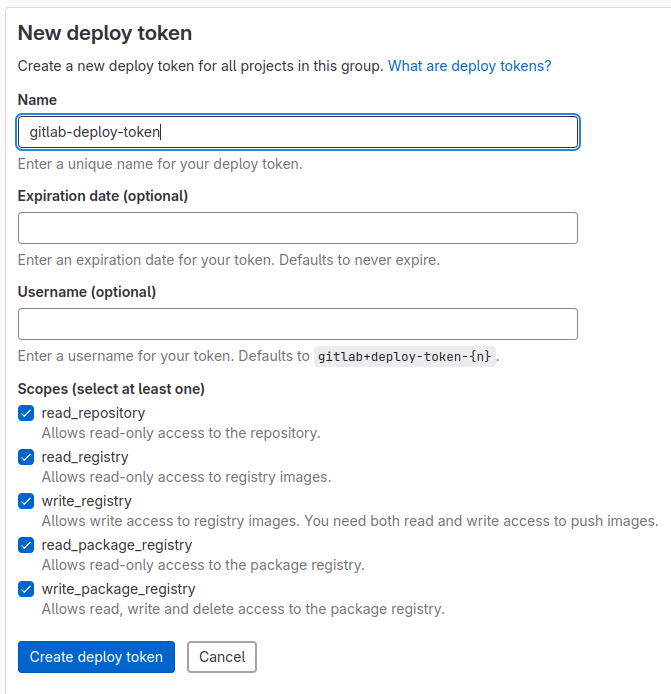
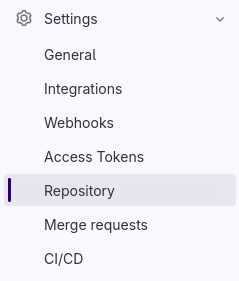
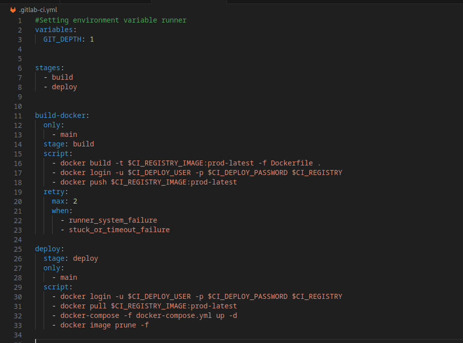
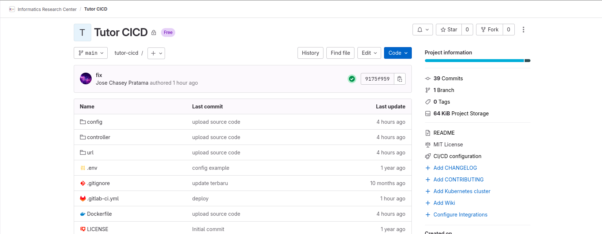

# Docker

###### Persiapan
- aplikasi `docker` dan `docker-compose` yang sudah terinstal.
- Siapkan aplikasi yang akan di *containerized* atau kontainerisasi.
Disini yang saya akan contohkan adalah aplikasi yang menggunakan bahasa pemrograman Go/Golang. Selain aplikasi, dibutuhkan juga *code editor* seperti *VSCode*.


[Link Menuju Aplikasi](https://github.com/aiteung/iteung)

## Langkah-Langkah

### Persiapan Aplikasi
*Clone* atau Unduh Project yang akan di kontainerisasi.
Disini akan dicontohkan *Clone* menggunakan *git*.
###### Catatan: disini git yang dicontohkan akan menggunakan SSH.

Pilih bagian *Local* kemudian pilih SSH. setelah muncul seperti pada gambar dibawah.


Kemudian klik tombol *Copy* untuk men salin link ssh dari *repository* aplikasi


Setelah itu, buka *terminal* di linux atau *git bash* di windows.


Setelah terbuka, silahkan ketik perintah ini
`git clone <link yang telah dicopy>`


Kemudian, tekan *enter* untuk melakukan *clone* dari *repository* ke komputer lokal



Setelah *Clone* berhasil, buka folder hasil *clone* tadi di *code editor* pilihan. *Code editor* yang akan digunakan disini adalah *VSCode*.

Perintah yang digunakan untuk membuka *VSCode* di folder hasil *Clone* `code iteung/`


Tampilan *VSCode* difolder *project* yang telah di *clone*


### Pembuatan Dockerfile

Sebelum membuat Dockerfile, buka *project*  terlebih dahulu di *Code Editor* pilihan. 
*Code editor* yang akan digunakan disini adalah *VSCode* dengan tampilan seperti berikut:


Setelah *project* terbuka, silahkan buat file bernama Dockerfile di *root* folder


Kemudian buka Dockerfile dengan klik 2x di nama filenya sampai muncul tampilan seperti berikut:


Setelah file *Dockerfile* nya terbuka, sekarang akan lanjut pembuatan *Image* dari aplikasi.

###### *Image* atau *Container Image* adalah file statis yang tidak dapat diubah yang mencakup kode yang dapat dieksekusi sehingga dapat menjalankan proses terisolasi pada infrastruktur TI. [Link](https://www.techtarget.com/searchitoperations/definition/container-image)

Disini, karena aplikasi yang digunakan aplikasi yang menggunakan bahasa pemrograman Go/Golang, *Base Image* yang diperlukan adalah *Image* yang bisa meng-*compile* dan menjalankan hasil dari *compile* tersebut.

Untuk mendapatkan *Base Image* yang diperlukan, langsung mengunjungi [Hub Docker](https://hub.docker.com/).


Setelah sampai di *landing page*, ketik *searchbox* `golang` untuk mencari *base image* untuk Dockerfile yang akan buat.


Pilih *image* yang paling atas



Tampilan setelah diklik


Setelah itu, pilih bagian *Tags* untuk memilih tag yang akan dipakai di Dockerfile sebagai *Base Image*


Pilih Tag yang paling atas


Kemudian klik tombol **Copy**


Setelah itu, kembali lagi ke *VSCode* dan *Paste* di Dockerfile seperti berikut:


Setelah di-*paste* ke dalam file Dockerfile sekarang akan lanjut ke tahap pembuatan intruksi atau *layer* didalam file Dockerfile.

### Pembuatan *Layer* Dockerfile

###### *Dockerfile* menggunakan *newline* untuk memisahkan antar *layer*

Tampilan *VSCode* sebelum melanjutkan ke pembuatan intruksi atau *layer*.


Sebelum itu, ganti perintah `docker pull` menjadi `FROM `. kemudian tambahkan `as` setelah nama tag `latest` sebagai alias untuk *layer*.


Setelah itu, tambahkan `WORKDIR /usr/src/app` dibawah `FROM`.
`WORKDIR` adalah sebuah perintah dalam Dockerfile yang digunakan untuk menetapkan direktori kerja (working directory) di dalam container Docker saat container tersebut berjalan.
Disini `WORKDIR` akan ditetapkan di `/usr/src/app`




Kemudian, tambahkan perintah `COPY . .` di-*layer* selanjutnya.
###### `COPY` adalah perintah yang digunakan dalam Dockerfile untuk menyalin file atau direktori dari host sistem (host system, yaitu sistem operasi tempat Docker berjalan) ke dalam image Docker yang sedang dibangun.

`COPY . . ` digunakan untuk menyalin semua file dan direktori dari direktori saat ini di host sistem (yaitu di mana perintah docker build dijalankan) ke dalam direktori saat ini di dalam image Docker yang sedang dibangun.


Setelah `COPY`, di-*layer* selanjutnya adalah `RUN`

###### `RUN` digunakan dalam Dockerfile untuk mengeksekusi perintah pada saat proses pembangunan image Docker. Perintah ini memungkinkan Anda untuk menjalankan perintah Linux atau perintah lainnya yang diperlukan untuk menyiapkan lingkungan kerja di dalam container Docker.

Perintah `RUN go build -o main .` digunakan dalam Dockerfile untuk membangun aplikasi Go yang terletak di direktori saat ini di dalam container Docker selama proses pembangunan image. 


Untuk memperkecil ukuran dari *image* dari Dockerfile, layer berikutnya akan menggunakan `FROM` agar hasil *image* dari Dockerfile kecil karena tidak membawa *dependency* yang tidak terpakai saat menjalankan aplikasi
Disini *Base Image* yang akan dipakai adalah debian dengan Tag latest


Kemudian, tetapkan direktori kerja (working directory) di dalam container Docker dengan `WORKDIR`.
Disini `WORKDIR` akan ditetapkan di `/usr/app`


Setelah itu, `COPY` hasil build dari aplikasi Go/Golang dari layer *image* sebelumnya ke dalam direktori saat ini di dalam container Docker saat proses pembangunan image.


Kemudian, di-*layer* terakhir adalah `ENTRYPOINT [ "/usr/app/main" ]`
`ENTRYPOINT [ "/usr/app/main" ]` dalam Dockerfile digunakan untuk menetapkan entry point atau titik masuk utama yang akan dijalankan saat container Docker berjalan. Ini menunjukkan bahwa *executable* yang disebut `main` yang terletak di dalam direktori `/usr/app/` di dalam container Docker akan menjadi titik masuk utama yang akan dieksekusi saat container tersebut dijalankan.


Setelah *layer* entrypoint sudah diketik, selanjutnya adalah membangun atau membuat *image* dari file *Dockerfile* yang sudah dibuat.

### Docker Image
Setelah membuat file *Dockerfile*, langkah selanjutnya adalah membuat *image* yang berisi aplikasi dari *Dockerfile* yang sudah dibuat.
Untuk membuat *image*, buka *terminal* atau *git bash* di PC/Laptop kemudian arahkan ke folder.


Setelah terbuka, ketik ``docker build -t new-project .` di terminal.


Perintah `docker build -t new-project .` digunakan untuk membangun image Docker dari Dockerfile yang terletak di direktori saat ini, sambil memberikan nama atau tag new-project pada image yang dihasilkan. 


Setelah *image* berhasil dibuat, langkah selanjutnya adalah menjalankan *image*.
Untuk menjalankan *image*, perintah yang digunakan adalah `docker run new-project`


Untuk mengetes aplikasi, bisa menggunakan browser, disini saya menggunakan Firefox kemudian memasukkan link `http://0.0.0.0:8080`


### Docker Compose
Docker Compose adalah alat yang digunakan untuk mendefinisikan dan menjalankan aplikasi Docker yang terdiri dari beberapa kontainer. 

Untuk menggunakan Docker Compose, pertama-tama buat docker-compose.yml


Copy text berikut kedalam compose
```
version: '3'

services:
  new_project:
    image: new-project:latest
    container_name: new_project
    ports:
      - "8080:8080"
```

- version: '3': Menentukan versi Docker Compose yang digunakan.
- services: Menentukan layanan-layanan yang akan dijalankan.
- new_project: Nama layanan yang diberikan.
- image: Menunjukkan nama image Docker yang akan digunakan untuk layanan ini, yaitu new-project:latest.
- container_name: Menentukan nama untuk container yang akan dibuat, yaitu new_project.
- ports: Menghubungkan port dari host ke container. Dalam kasus ini, port 8080 pada host akan dihubungkan ke port 8080 pada container.

Setelah membuat file docker-compose.yml dan mengisi file terebut dengan text diatas. selanjutnya bisa langsung ke *terminal* atau *git bash* untuk menjalankan perintah `docker compose up -d`


Setelah berhasil, untuk mengecek apakah aplikasi jalan atau tidak, bisa langsung ke `http://0.0.0.0:8080` dibrowser favorit. Disini akan dicontohkan menggunakan firefox.


### CI/CD
Untuk integrasi ke CI/CD, diperlukan repository sebagai *version control* dari aplikasi. Platform *git* yang akan digunakan disini adalah [Gitlab](https://gitlab.com).


Tampilan Gitlab Sebelum Login.



Tampilan Gitlab setelah login.


Setelah itu, kemudian buat Repository dengan menekan tombol *New Project*


Setelah itu, tampilan akan berubah menjadi seperti berikut:


Kemudian klik, *Create Blank Project*, tampilan akan berubah seperti berikut.


Sesuaikan agar seperti gambar berikut:


Setelah itu, klik *Create Project*.
Tampilan akan berubah seperti berikut:


Setelah *repository* dibuat, langkah selanjutnya yaitu setting URL *repository* yang telah dibuat di *repository* local.

Untuk menambahkan URL git di repository local, buka *terminal* atau *git bash*.


Setelah terbuka, ketik `git remote add upstream git@gitlab.com:informatics-research-center/tutor-cicd.git`


Setelah itu, jalankan perintah `git add .` untuk menambahkan semua file yang diubah ataupun ditambahkan.


Kemudian, jalankan perintah `git commit -m 'upload source code'` untuk melakukan *commit* ke git.


Selanjutnya, jalankan perintah `git push upstream main` untuk meng-*upload* source code ke Gitlab.


Tampilan setelah *git push* ke repository.


#### Setup Gitlab CI/CD
Untuk Setup Gitlab CI/CD, pertama-tama pergi ke repository.


Kemudian, di *sidebar* sebelah kiri, pilih *Settings*



Pilih *Repository*


Setelah tampilan berubah, pilih bagian *Deploy Tokens*


Klik tombol *Add Token*


Tampilan Deploy Token


Dibagian *Name*, diisi `gitlab-deploy-token`

Bagian *Expiration date (optional)* dan *Username (optional)* tidak perlu diisi.
Untuk bagian Scopes, centang semua *checkbox*.



Kemudian klik *Create Deploy Token*, Tampilan akan seperti berikut:


Setelah setting *Deploy Token* selesai, selanjutkan akan ke bagian Runner.

Untuk Runner, kembali ke *sidebar* sebelah kiri, kemudian klik *CI/CD*



Setelah tampilan sudah seperti berikut:


Pada bagian *Runners* klik *Expand* dan tampilan akan berubah seperti berikut:


Kemudian, pada bagian *Enable instance runners for this project*, klik *Toggle Switch* agar men-*disable* *Shared Runner* dari gitlab.
Setelah itu, dibagian sebelah kanan bagian *Other available runners*, klik *Enable for this Project* dibagian Docker.
Tampilan runner akan berubah jadi seperti berikut:


#### File .gitlab-ci-yml
Setelah melakukan Tahapan Setup Gitlab CI/CD, langkah selanjutnya adalah membuat file **.gitlab-ci.yml**.

Buat file `.gitlab-ci.yml`.


Kemudian tambahkan baris berikut didalam file .gitlab-ci.yml
```yaml
variables:
  GIT_DEPTH: 1
```
Bagian ini digunakan untuk mendefinisikan variabel GIT_DEPTH dengan nilai 1. Variabel ini mengontrol kedalaman riwayat repositori Git yang akan diambil selama proses git clone dalam CI/CD. 


```yaml
stages:
  - build
  - deploy
```
Bagian stages mendefinisikan urutan langkah-langkah yang akan dieksekusi dalam pipeline CI/CD.


```yaml
build-docker:
  only:
    - main
  stage: build
  script:
    - docker build -t $CI_REGISTRY_IMAGE:prod-latest -f Dockerfile .
    - docker login -u $CI_DEPLOY_USER -p $CI_DEPLOY_PASSWORD $CI_REGISTRY
    - docker push $CI_REGISTRY_IMAGE:prod-latest
  retry:
    max: 2
    when:
      - runner_system_failure
      - stuck_or_timeout_failure
```
menambahkan job yang diberi nama `build-docker`. Job ini akan dieksekusi hanya ketika perubahan dilakukan pada branch main (melalui bagian only). Job ini termasuk dalam tahap build (melalui bagian stage). Script yang terdiri dari beberapa langkah akan dieksekusi dalam job ini, di mana langkah-langkah tersebut mencakup:
- Membangun image Docker menggunakan Dockerfile yang ada di direktori saat ini, kemudian menamai image tersebut dengan`CI_REGISTRY_IMAGE:prod-latest`.
- Melakukan login ke registry Docker menggunakan username dan password yang telah disetel sebelumnya dalam GitLab CI/CD environment variables (`$CI_DEPLOY_USER` dan `$CI_DEPLOY_PASSWORD`), serta registry URL yang disediakan oleh GitLab (`$CI_REGISTRY`).
- Mengunggah image Docker yang telah dibangun sebelumnya ke registry Docker dengan nama `$CI_REGISTRY_IMAGE:prod-latest`.
- Konfigurasi retry menentukan bahwa job ini akan diulang maksimal 2 kali dalam kasus kegagalan sistem atau timeout.


```yaml
deploy:
  stage: deploy
  only:
    - main
  script:
    - docker login -u $CI_DEPLOY_USER -p $CI_DEPLOY_PASSWORD $CI_REGISTRY
    - docker pull $CI_REGISTRY_IMAGE:prod-latest
    - docker-compose -f docker-compose.yml up -d
    - docker image prune -f
```
menambahkan job yang diberi nama deploy. Job ini akan dieksekusi hanya ketika ada perubahan pada branch main (melalui bagian only). Job ini termasuk dalam tahap deploy (melalui bagian stage). Langkah-langkah yang akan dieksekusi dalam job ini adalah:
- Melakukan login ke registry Docker menggunakan username dan password yang telah disetel sebelumnya dalam GitLab CI/CD environment variables (`$CI_DEPLOY_USER` dan `$CI_DEPLOY_PASSWORD`), serta registry URL yang disediakan oleh GitLab (`$CI_REGISTRY`).
- Mengambil image Docker yang telah diunggah sebelumnya dari registry Docker dengan nama `$CI_REGISTRY_IMAGE:prod-latest`.
- Menjalankan file docker-compose.yml dengan perintah `docker-compose up -d`, yang akan membuat dan menjalankan container berdasarkan konfigurasi yang didefinisikan dalam file tersebut.
- Membersihkan image yang tidak digunakan lagi dari cache dengan perintah `docker image prune -f`.



Setelah setting `.gitlab-ci.yml`, hal yang perlu diubah adalah `docker-compose.yml`

dibagian:
```yaml
    image: new-project:latest
```
diganti menjadi:
```yaml
    image: $CI_REGISTRY_IMAGE:prod-latest
```


Agar *image* yang diambil adalah *image* yang dibuild di CI/CD.

Setelah selesai, *update* source code di git repository dengan cara
```bash
git add .
git commit -m 'deploy'
git push upstream
```

Repository akan menampilkan seperti berikut:


Sekarang waktunya menunggu Aplikasi sukses *deploy* ke Docker.  

Setelah selesai, tampilan repository akan seperti berikut:  


Aplikasi telah selesai di-*deploy* ke server. Langkah selanjutnya adalah mem-*public* aplikasi.

### Public Website
Sebelum mem-public aplikasi, pertama yang harus disiapkan adalah domain.
Untuk setup public domain, silakan ke DNS manager yang dimiliki, disini yang akan digunakan adalah Cloudflare.
Untuk setting Cloudflare silahkan, Login ke [Cloudflare](https://dash.cloudflare.com/login).

Kemudian, didashboard pilih Domain yang akan digunakan, di *sidebar* sebelah kiri, pilih bagian *DNS*


Kemudian, pada bagian *Record*, pilih tombol *Add Record*


Setelah itu, pada bagian *Type* ubah menjadi *CNAME*.


Setelah itu, isi *Name (required)* dan *Target (required)* sesuai dengan website yang akan dipublic


Setelah itu, klik tombol *Save*


Setelah selesai, langkah selanjutnya adalah setup rules di *reverse proxy* server.

Selanjutnya akan masuk ke server.
Untuk masuk ke server silahkan ketik `ssh <username>@<server>`


Setelah itu, ketik `cd /etc/nginx/sites-enable/`


Setelah sukses ke `/etc/nginx/sites-enable` langkah selanjutnya adalah membuat rules untuk *reverse proxy*.
###### Catatan: Didalam foler sites-enable banyak rules, untuk mempermudah, rules yang akan digunakan adalah rules dari aplikasi KimTeungBim

Untuk mempermudah pembuatan rules, disini akan digunakan rules dari aplikasi yang sudah ada, yaitu KimTeungBim.
ketik `sudo cp kimteungbim belajarcicd`


Setelah itu, buka nano untuk mengubah rules yang ada didalam file belajarcicd
ketik `sudo nano belajarcicd`


Tampilan akan seperti berikut:


Setelah itu, ubah sub-domain kimteungbim, menjadi domain yang tadi telah dibuat, yaitu belajarcicd.
Kemudian pada bagian `proxypass http://10.14.200.20` tambahkan port `8080` dibagian belakang menjadi seperti ini `proxypass http://10.14.200.20:8080`


Setelah itu save dan exit.

Setelah berhasil keluar, ketik `sudo nginx -t` untuk mengecek konfigurasi nginx agar tidak ada yang konflik


Setelah selesai, sekarang ketik `sudo nginx -s reload` untuk melakukan reload terhadap konfigurasi nginx yang telah dibuat.


Setelah selesai, silahkan ke `belajarcicd.ulbi.ac.id` untuk mencoba aplikasi yang sudah di *deploy* dan di *public*

